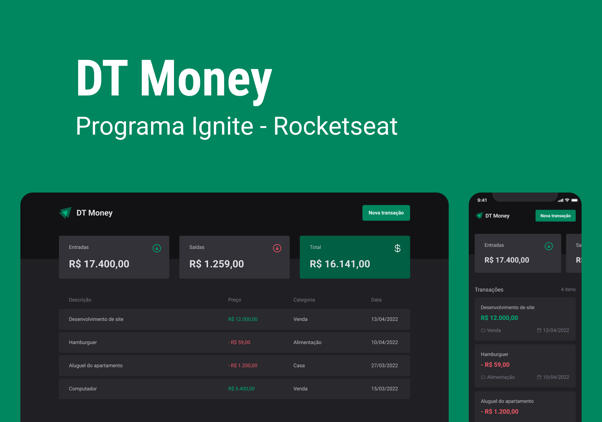

# DT Money

<p align="center">
  
  
  
  
  
</p>

<p align="center">
  Projeto de controle financeiro desenvolvido no Ignite, o programa de aceleração da Rocketseat.
</p>

## 📋 Índice

- [📖 Sobre o Projeto](#-sobre-o-projeto)
- [📷 Demonstração](#-demonstração)
- [✨ Funcionalidades](#-funcionalidades)
- [💻 Tecnologias Utilizadas](#-tecnologias-utilizadas)
- [🚀 Como Executar](#-como-executar)
- [🎨 Layout](#-layout)
- [📜 Licença](#-licença)

---

## 📖 Sobre o Projeto

O **DT Money** é uma aplicação de controle financeiro desenvolvida como desafio do Ignite 2022 (trilha de ReactJS da Rocketseat).

O objetivo é construir uma interface moderna para gerenciar transações financeiras (entradas e saídas). A aplicação consome uma API (simulada com `json-server` localmente) e permite ao usuário cadastrar e listar transações, além de exibir um resumo financeiro no topo da página.

---

## 📷 Demonstração

<p align="center">
  
</p>

---

## ✨ Funcionalidades

- **Dashboard:** Exibe um resumo das finanças com o total de entradas, saídas e o saldo total.
- **Listagem de Transações:** Exibe todas as transações cadastradas.
- **Busca por Transações:** Permite ao usuário filtrar transações por descrição ou categoria.
- **Cadastro de Transações:** Permite o cadastro de novas transações através de um modal (com validação de formulário).
- **Ambiente Mocado:** Em produção (Vercel), a aplicação usa uma API mocada (simulada) para funcionar sem um backend real, enquanto em desenvolvimento usa o `json-server`.

---

## 💻 Tecnologias Utilizadas

Este projeto foi construído com as seguintes tecnologias:

- **React.js** (com **Vite**)
- **TypeScript**
- **Styled-Components** (para estilização)
- **Radix UI** (para componentes acessíveis, como o Modal)
- **React Hook Form** (para gerenciamento de formulários)
- **Zod** (para validação de schemas)
- **Axios** (para requisições HTTP)
- **use-context-selector** (para otimização de performance do Context API)
- **JSON-Server** (para simulação de API em desenvolvimento)
- **ESLint** e **Prettier** (para padronização de código)

---

## 🚀 Como Executar

Siga os passos abaixo para rodar o projeto localmente:

1.  **Clone o repositório**
    ```bash
    git clone https://github.com/Robson16/dt-money.git
    ```
2.  **Acesse a pasta do projeto**
    ```bash
    cd dt-money
    ```
3.  **Instale as dependências**
    ```bash
    npm install
    ```
4.  **Configure as variáveis de ambiente**
    Crie um arquivo `.env` na raiz do projeto e adicione a seguinte variável (ela será usada pelo Axios em modo de desenvolvimento):
    ```env
    VITE_API_URL=http://localhost:3333
    ```
5.  **Inicie o servidor da API**
    Em um terminal, rode o `json-server` (ele usará o arquivo `server.json`):
    ```bash
    npm run server
    ```
6.  **Inicie a aplicação**
    Em outro terminal, rode o projeto React (Vite):
    ```bash
    npm run dev
    ```
A aplicação estará disponível em `http://localhost:5173` (ou a porta que o Vite indicar).

---

## 🎨 Layout

O layout da aplicação foi desenvolvido pela Rocketseat e está disponível no Figma.

<a href="https://www.figma.com/design/NTpD6HKJ8pqpriPfituNQ5/DT-Money--Community-?m=auto&t=riFy34zVFRntM7vM-6" target="_blank">
  
</a>

---

## 📜 Licença

Este projeto está sob a licença MIT. Veja o arquivo `LICENSE` para mais detalhes.

---

Feito com ☕❤ por [Robson H. Rodrigues](https://github.com/Robson16)
